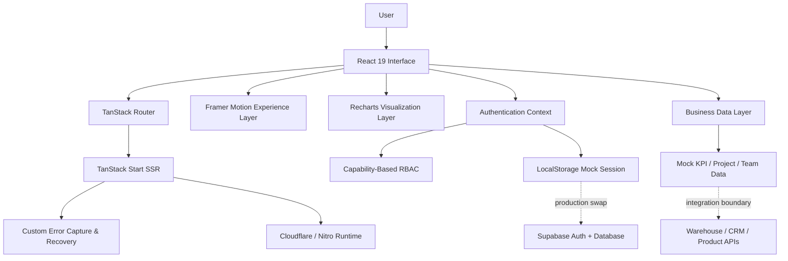

<div align="center">


<br />

<a href="https://git.io/typing-svg">
  
</a>

<p>
  <strong>A cinematic, AI-powered executive dashboard for monitoring business health, uncovering risks, coordinating delivery, and turning operational data into decisive action.</strong>
</p>

<p>
  <a href="https://github.com/Darshan-paapani06/Nexusflow-AI-Dashboard/stargazers"></a>
  <a href="https://github.com/Darshan-paapani06/Nexusflow-AI-Dashboard/network/members"></a>
  
  
</p>

<p>
  
  
  
  
  
  
</p>

[Overview](#-overview) · [Features](#-core-capabilities) · [Architecture](#-architecture) · [Quick Start](#-quick-start) · [Author](#-author)

</div>

---

## ✦ Overview

**NexusFlow AI** is an enterprise-grade command center that brings revenue intelligence, project execution, operational risk, team performance, and AI-assisted recommendations into one cohesive experience.

The interface is designed for **founders, operators, managers, and executive teams** who need a high-signal view of the business without switching between fragmented tools. It combines a futuristic glassmorphism design system with animated data storytelling, role-aware controls, and a modular architecture that is ready for real APIs and Supabase.

> **Current project mode:** polished front-end experience with mock business data, local session persistence, and production-oriented integration boundaries.

## ✦ Core Capabilities

| Capability | What it delivers |
|---|---|
| **Executive Overview** | Six mission-critical KPIs with animated counters, trend deltas, and live sparkline signals. |
| **Nexus AI Analyst** | Context-aware insight generation, risk explanations, and recommended next actions. |
| **Advanced Analytics** | Revenue forecasts, productivity comparisons, task distribution, and department performance visualizations. |
| **Project Command Board** | Interactive Kanban workflow for creating, prioritizing, and tracking work across teams. |
| **Smart Alerts Center** | Business-impact-ranked alerts for anomalies, delivery risk, churn, infrastructure, and campaign efficiency. |
| **Team Performance** | A high-signal talent view covering productivity, workload, availability, project ownership, and task throughput. |
| **Role-Based Access** | Capability-driven permissions for `admin`, `manager`, and `member` roles. |
| **Workspace Settings** | Controls for workspace identity, theme, AI insight cadence, and notification preferences. |
| **Resilient SSR** | Custom server error capture and graceful HTML fallback for catastrophic rendering failures. |

## ✦ Experience Design

NexusFlow is built to feel like a real command center—not a collection of static cards.

- Cinematic hero composition with animated aurora effects and dimensional UI layers
- Glassmorphism surfaces, gradient typography, responsive layouts, and OLED-optimized dark styling
- Motion-powered entrances, transitions, hover states, loading feedback, and live-status indicators
- Scroll-aware section navigation and command-style search for rapid dashboard access
- Responsive behavior across desktop, tablet, and mobile viewports

## ✦ Technology Stack

| Layer | Technology |
|---|---|
| **UI Runtime** | React 19 |
| **Full-stack Framework** | TanStack Start |
| **Routing** | TanStack Router |
| **Language** | TypeScript 5.8 |
| **Styling** | Tailwind CSS 4 + custom design tokens |
| **Animation** | Framer Motion + CSS keyframes |
| **Visualization** | Recharts |
| **UI Primitives** | Radix UI |
| **Forms & Validation** | React Hook Form + Zod |
| **Icons** | Lucide React |
| **Notifications** | Sonner |
| **Build System** | Vite 8 + Nitro |
| **Target Runtime** | Cloudflare-ready server build |

## ✦ Architecture



### Role and capability model

```text
Admin   → Workspace, roles, projects, tasks, alerts, insights, analytics
Manager → Projects, tasks, alerts, insights, analytics
Member  → Tasks, insights, analytics
```

Permissions are mapped to capabilities rather than scattered role checks, keeping authorization logic centralized and easier to evolve.

## ✦ Quick Start

### Prerequisites

- **Node.js 20+** recommended
- **npm** included with Node.js
- **Git** for source control

### Installation

```bash
git clone https://github.com/Darshan-paapani06/Nexusflow-AI-Dashboard.git
cd Nexusflow-AI-Dashboard
npm install
npm run dev
```

Open the local URL printed by Vite in your terminal.

### Production build

```bash
npm run build
npm run preview
```

### Available scripts

| Command | Purpose |
|---|---|
| `npm run dev` | Start the local development server. |
| `npm run build` | Generate the optimized production build. |
| `npm run build:dev` | Build using development mode. |
| `npm run preview` | Preview the production build locally. |
| `npm run lint` | Run ESLint across the project. |
| `npm run format` | Format the codebase with Prettier. |

## ✦ Project Structure

```text
Nexusflow-AI-Dashboard/
├── public/                    # Static assets
├── src/
│   ├── components/
│   │   ├── nexus/             # Product-specific dashboard modules
│   │   └── ui/                # Reusable Radix-powered UI components
│   ├── hooks/                 # Responsive and shared React hooks
│   ├── lib/
│   │   ├── auth/              # Session, roles, and capability logic
│   │   ├── mock-data.ts       # Demo business datasets
│   │   └── error-*.ts         # Runtime error capture and fallback UI
│   ├── routes/                # TanStack file-based routes
│   ├── server.ts              # SSR server entry and error normalization
│   ├── start.ts               # Request middleware configuration
│   └── styles.css             # Design system, tokens, utilities, animations
├── package.json
├── tsconfig.json
└── vite.config.ts
```

## ✦ Authentication & Production Integration

The current authentication layer is intentionally **Supabase-ready** while remaining easy to run locally:

- Sessions are persisted in `localStorage` for demonstration.
- Email sign-in, workspace creation, Google sign-in, and sign-out flows are represented.
- The public `useAuth()` contract remains stable when the mock store is replaced.
- Inline integration guidance identifies the exact swap points for Supabase Auth, profiles, roles, and workspaces.

For production, replace the mock session block with your Supabase client, database tables, and row-level security policies.

## ✦ Deployment Readiness

The Lovable TanStack Vite configuration includes a **Nitro Cloudflare target**. Before production deployment:

1. Connect real environment variables and secrets.
2. Replace mock authentication and business data sources.
3. Configure the Cloudflare project and runtime bindings.
4. Run `npm run build` and validate the generated server output.
5. Add monitoring, analytics, and error reporting for the target environment.

## ✦ Product Roadmap

- [ ] Supabase authentication, profiles, workspaces, and row-level security
- [ ] Live CRM, finance, product, and warehouse connectors
- [ ] Streaming KPI refresh and real-time operational alerts
- [ ] Persistent projects, tasks, comments, and audit history
- [ ] AI insight orchestration with citations and confidence scoring
- [ ] Exportable executive reports and scheduled briefings
- [ ] Multi-workspace support and enterprise SSO
- [ ] Automated tests, CI checks, and deployment workflows

## ✦ Contributing

Contributions, ideas, and product feedback are welcome.

```bash
# 1. Fork the repository
# 2. Create a focused branch
git checkout -b feature/your-feature

# 3. Commit your work
git commit -m "feat: add your feature"

# 4. Push and open a pull request
git push origin feature/your-feature
```

Please keep changes focused, typed, responsive, and consistent with the existing visual system.

## ✦ Author

<div align="center">

### Darshan Paapani

**Creator & Developer — NexusFlow AI Dashboard**

<a href="https://github.com/Darshan-paapani06">
  
</a>

<br /><br />

Built with ambition, thoughtful engineering, and a forward-looking vision for intelligent business operations.

</div>

---
Go Live:
nexusflowaidashboard.darshudarshan45407.workers.dev
<div align="center">

### Turn business signals into coordinated action.

<sub>© 2026 Darshan Paapani. NexusFlow AI.</sub>

<br /><br />


</div>
